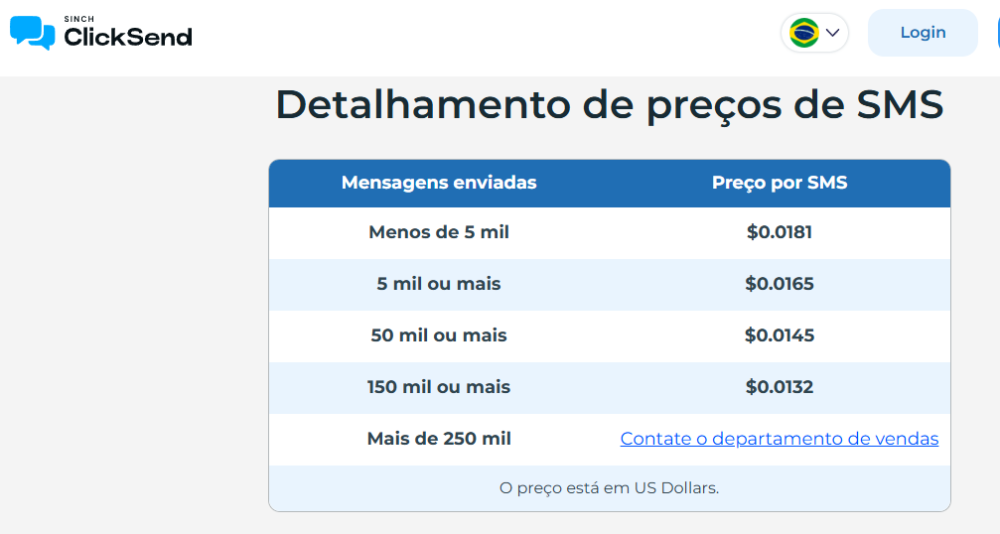

# 📌 Reunião

## Perguntas

### 1. Quais **todos** os canais que serão adicionados nesta versão 2?
**R:** WhatsApp, SMS, Telegram

### 2. Dos canais, qual é o mais prioritário?
**R:** _(definir)_

### 3. Todos os tipos de avisos devem ser adicionados nesta versão 2?
**R:** _(definir)_

### 4. Qual aviso é prioritário?
**R:** _(definir)_

---

## 📊 Custos por Canal

| Canal     | Empresa   | Custo (1x) | Custo (1000x) |
|-----------|-----------|-------------|---------------|
| SMS       | ClickSend | $0,0181     | $18,10        |
| SMS       | Infobip   | $0,0300     | $27,33        |
| WhatsApp  | Infobip   | $0,0100     | $9,01         |
| WhatsApp  | Meta      | $0,0068     | $6,80         |

> ⚠️ Observações:
> - Criação de conta no **WhatsApp Business**  
> - Aprovação de **templates**  
> - Restrição da janela de **24 horas**  
> - Custos variam conforme **cotação do dólar**  

---

## 🚀 Próximos Passos

- [ ] Validação de arquitetura/protótipo (refinamento)  
- [ ] Definição de responsabilidades de cadastro nas plataformas  

---

